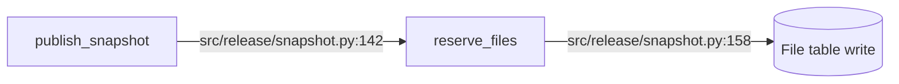
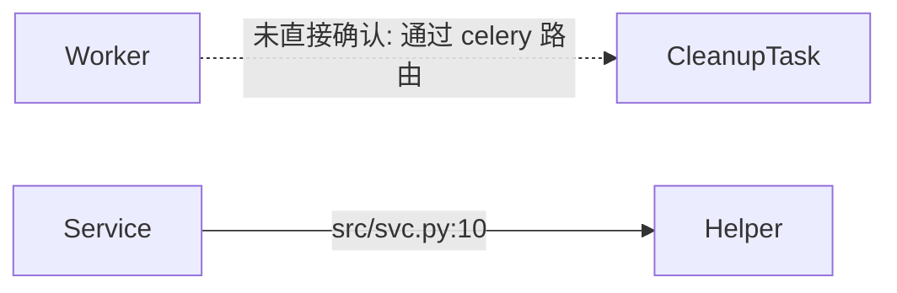
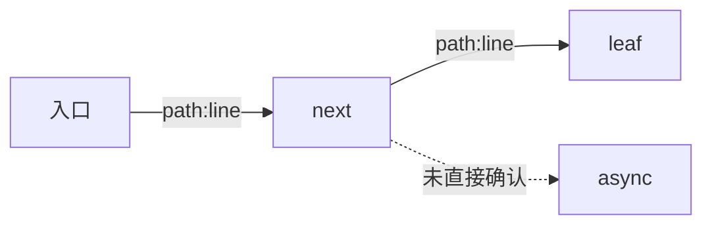
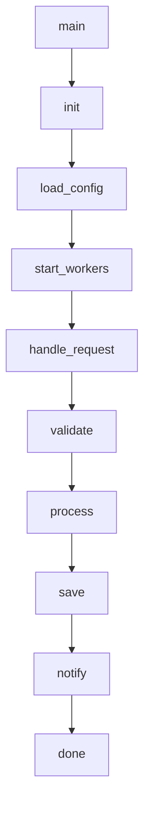

# Call Graph Conventions

Mermaid 调用链路图是 `repo-profile.md` 的标准产物。本文规定护栏，防止"漂亮但伪造"的调用图（D1 反噬：图比文字更易伪造，视觉权威感欺骗）。

> 第一约束：见 `authenticity.md`。本文所有规则在它之下。

## 为什么要护栏

Agent 在面对几十上百个文件时不可能画出完整调用图。在没有护栏的情况下，常见问题：

- 节点是真的（grep 得到的函数名），**边是猜的**（"应该会调用 X"）
- 完整度过高 → 必然有伪造
- 漂亮的 mermaid + 假节点比纯文字更难发现伪造

护栏的目的是把"我看到了什么"和"我推断什么"在视觉上分开。

## 5 条硬护栏

### 护栏 1：每条边必须可证

边上必须带 `path:line` 标签，标识该调用关系的代码位置：



- 标签格式：`path:line` 或 `path:line-line` 区间
- 路径相对 repo 根
- 不允许只写函数名而不带定位

### 护栏 2：单图节点数 ≤ 30

超过 30 个节点强制拆图，按子模块/use case 分。例如：

- `repo-profiles/api-gateway.md` → `## 调用图：HTTP 入口`、`## 调用图：后台任务`、`## 调用图：跨服务出站`
- 每张图独立，节点不互相引用

理由：人脑能处理的 mermaid 复杂度上限约 25-30 节点，超过即使图正确也无法 review。

### 护栏 3：从入口起深度 ≤ 4 层

每张图最多 4 层调用深度。第 5 层及之后用占位节点截断，**不假装画到底**：


第 5 层占位节点格式：`"...(更深 N 层未追踪)"` 或 `"...(N more layers)"`。**禁止**画一条直接从 A 到第 5 层的边。

### 护栏 4：未确认边用虚线

只要不是从静态代码 100% 可证的边，必须用虚线 `-.->` 并加文字标记：



何时用虚线：
- 通过反射/字符串名/动态分发调用
- 通过事件总线/消息队列间接触发（生产者消费者解耦）
- 通过 DI 容器注入，运行时才解析
- 通过装饰器/AOP 间接挂载

何时用实线：
- 直接函数/方法调用，可在源文件中定位到调用语句

### 护栏 5：每张图必须配 "未覆盖区域" 段

调用图块之后立即跟一段 markdown：

```markdown
**未覆盖区域**
- 错误回退路径（`except` 分支未追踪）
- 中间件链路（auth/logging/metrics 未画入）
- 第三方 SDK 内部（`boto3` / `requests` 内部不展开）
```

诚实声明 agent 没看的地方。这是 D1 honest-uncertainty marker 在调用图上的实现。**禁止**省略这段，即使"全都覆盖了"——也至少声明 "已覆盖至深度 4，未追踪外部库内部"。

## Mermaid 模板

每个 repo-profile 的调用图段都按这个骨架：

````markdown
## 调用图：<场景名>

> 入口：<入口名+定位>；目的：<这张图想说明什么>



**未覆盖区域**
- <已知但未画入的入口或路径>
- <截断深度处的未追踪层>
````

## 反例（禁止出现）

下面这种图直接拒收：



问题：
- 边无 `path:line` 标签（违反护栏 1）
- 10 层深度（违反护栏 3）
- 全部实线但显然是模板化串接（违反护栏 4 的精神：agent 不可能 100% 确认每条边）
- 无未覆盖声明（违反护栏 5）

## 与 validator 的衔接

`scripts/validate_bug_package.py` 对 `submit/knowledge/repo-profiles/*.md` 中的 ```mermaid``` 块做轻量检查：

- 节点数 > 30 → WARN
- 形如 `[xxx] -.-> [yyy]`（虚线边）的存在不是问题；**不存在任何虚线边**也不是问题（小型 repo 可能确实全部直接调用）；validator 不强制虚线
- 紧跟 ```mermaid``` 块之后未在 5 行内出现 "未覆盖" / "Uncovered" 字样 → WARN

护栏 1（边的 path:line 标签）和护栏 3（深度）validator 不做硬检查（mermaid 解析复杂、深度判断需要构图），交给 evaluator Q5 + Q6 人工/AI 复核。

## 借鉴痕迹

本文的"边可证"和"未覆盖区"思路借鉴自：

- `systematic-debugging` skill — 在多组件系统中"在每个组件边界采集证据"的做法（v?，借鉴日期 2026-05-07）
- 静态分析工具（如 CodeQL）通用做法 — 区分 "explicit call" 与 "indirect/dataflow" 的视觉编码
