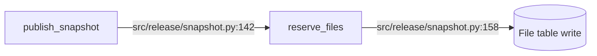
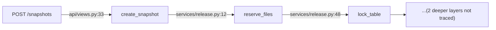
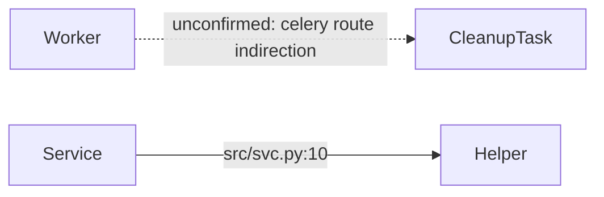
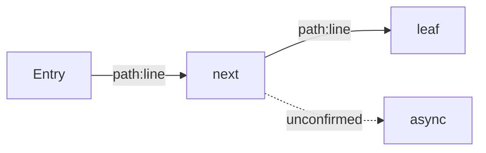
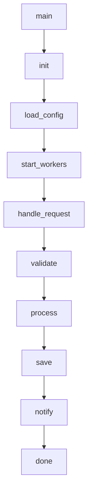

# Call Graph Conventions

Mermaid call graphs are the default profile artifact for repository execution paths. The rules below prevent attractive but fabricated diagrams. For <=10-file utility repos, use the small-repo exemption in `repo-profile.md` when text is clearer than a diagram.

> First constraint: see `authenticity.md`. Visual authority never outranks code evidence.

## Contents

- Why Guardrails Exist
- Five Guardrails
- Template
- Rejected Pattern
- Validator Linkage

## Why Guardrails Exist

Agents cannot fully map every call path in large repos. Without guardrails, common failures are:

- nodes are real because grep found the names, but edges are guessed;
- the diagram claims complete coverage that the audit did not earn;
- a polished Mermaid graph makes fabricated relationships harder to notice.

The goal is to separate "seen in code" from "inferred or unconfirmed."

## Five Guardrails

### 1. Every Edge Needs Evidence

Every edge label must include a `path:line` or `path:line-line` anchor for the call relationship:



Rules:

- paths are relative to repo root;
- labels must identify the code location for the relationship;
- function names alone are not enough.

### 2. Keep Each Diagram <=30 Nodes

Split larger graphs by subsystem or use case, for example:

- `repo-profiles/api-gateway.md` -> `## Call Graph: HTTP Entry`
- `repo-profiles/api-gateway.md` -> `## Call Graph: Background Jobs`
- `repo-profiles/api-gateway.md` -> `## Call Graph: Cross-Service Outbound`

Large correct diagrams are still hard to review.

### 3. Limit Depth to Four Layers

From each entry point, draw at most four call layers. At layer five and beyond, stop with an explicit placeholder:



Do not draw a direct edge from the entry point to a deeper function to imply skipped certainty.

### 4. Use Dashed Edges for Unconfirmed Links

Any relationship that is not statically certain uses `-.->` and a label:



Use dashed edges for:

- reflection or string-based dispatch;
- event bus or queue indirection;
- dependency injection containers;
- decorators, AOP, or runtime registration.

Use solid edges only for direct calls located in source code.

### 5. Add an Uncovered Areas Paragraph

Immediately after each Mermaid block, add:

```markdown
**Uncovered Areas**
- Error fallback paths (`except` branches not traced)
- Middleware chain (auth/logging/metrics not drawn)
- Third-party SDK internals (`boto3` / `requests` not expanded)
```

Never omit this section. If coverage is unusually complete, still state the depth and external-library limits.

## Template

````markdown
## Call Graph: <scenario>

> Entry: <entry name + location>; purpose: <what this graph explains>



**Uncovered Areas**
- <known entry or path not drawn>
- <truncated deeper layer>
````

Small-repo exemption: write `Call Graph Exemption: <=10-file small repo; text summary is clearer.` and list entry points, core functions, and uncovered areas in text.

## Rejected Pattern



Problems:

- edges have no `path:line` labels;
- depth is too high;
- all edges are solid despite likely indirection;
- no uncovered-area paragraph.

## Validator Linkage

`scripts/validate_bug_package.py` runs light checks on `submit/knowledge/repo-profiles/*.md`:

- node count >30 -> WARN;
- no Mermaid and no `Call Graph Exemption` marker (or Chinese compatibility marker `调用图豁免`) -> WARN;
- no `Uncovered` paragraph (or Chinese compatibility label `未覆盖`) after a Mermaid block -> WARN.

The validator does not hard-check edge labels or graph depth. Those remain evaluator responsibilities.
